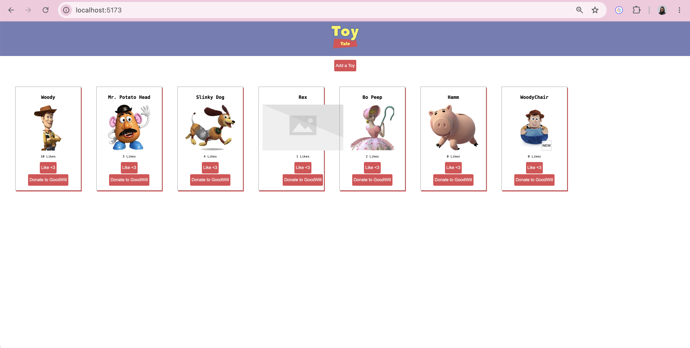

# Toy Tales

Andy has misplaced his toys again. This app connects a React front end to a JSON backend so you can view, add, like, and donate toys, keeping Andy's collection organized.

## Features

- View all toys on page load
- Add a new toy through a form (likes start at 0)
- Like a toy to increase its like count
- Donate (delete) a toy to remove it from the list

## Installation

Clone the repo, then install dependencies:

npm install

## Usage

Start the backend in one terminal. This runs `json-server` against `db.json` at `http://localhost:3001`:

npm run server

Start the dev server in a second terminal:

npm run dev

Open the URL printed in your terminal (Vite's default is `http://localhost:5173`).

## Testing

Run the test suite in a third terminal:

npm run test

All 5 tests should pass across 4 test files: display, add, like, donate.

## How it works

- **On load**, `App` makes a GET request to `/toys` and stores the result in state. `ToyContainer` renders a `ToyCard` for each toy.
- **Submitting `ToyForm`** makes a POST request to `/toys` with the new toy's name, image, and `likes: 0`. The server's response is added to state so the new `ToyCard` renders immediately.
- **Clicking "Donate to GoodWill"** makes a DELETE request to `/toys/:id`. On success, that toy is filtered out of state and its card disappears.
- **Clicking the like button** makes a PATCH request to `/toys/:id` with `{ likes: <new count> }`. State updates in place (using `map`, not remove-and-re-add) so the toy keeps its position in the list.

## Tech stack

React, Vite, json-server, Vitest, React Testing Library.

